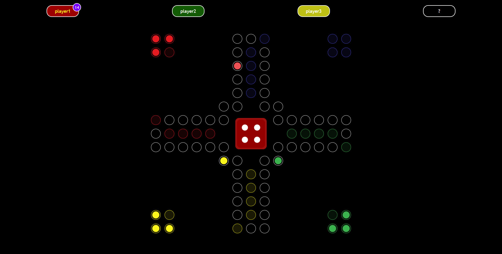

# Ludo
Multiplayer ludo game

##  Overall info

A popular ludo game of getting your pawns to the base.

The game is multiplayer and requires at least two players to start playing.

## Installation

 - Clone/download the repository
 - Prepare database `\Database\database.sql`
 - Run `\Project` with the PHP server (e.g. XAMPP) 
 - `index.html` is the initial file
    

## Features

- Multiplayer (2-4 players)
- Room system (public/privte)
- Turn-based gameplay
- Backend anti-cheating firewall
- Session system
- Inactivity kick-out system
- Speech syntesis

## Technologies

  
  
   

 
 

